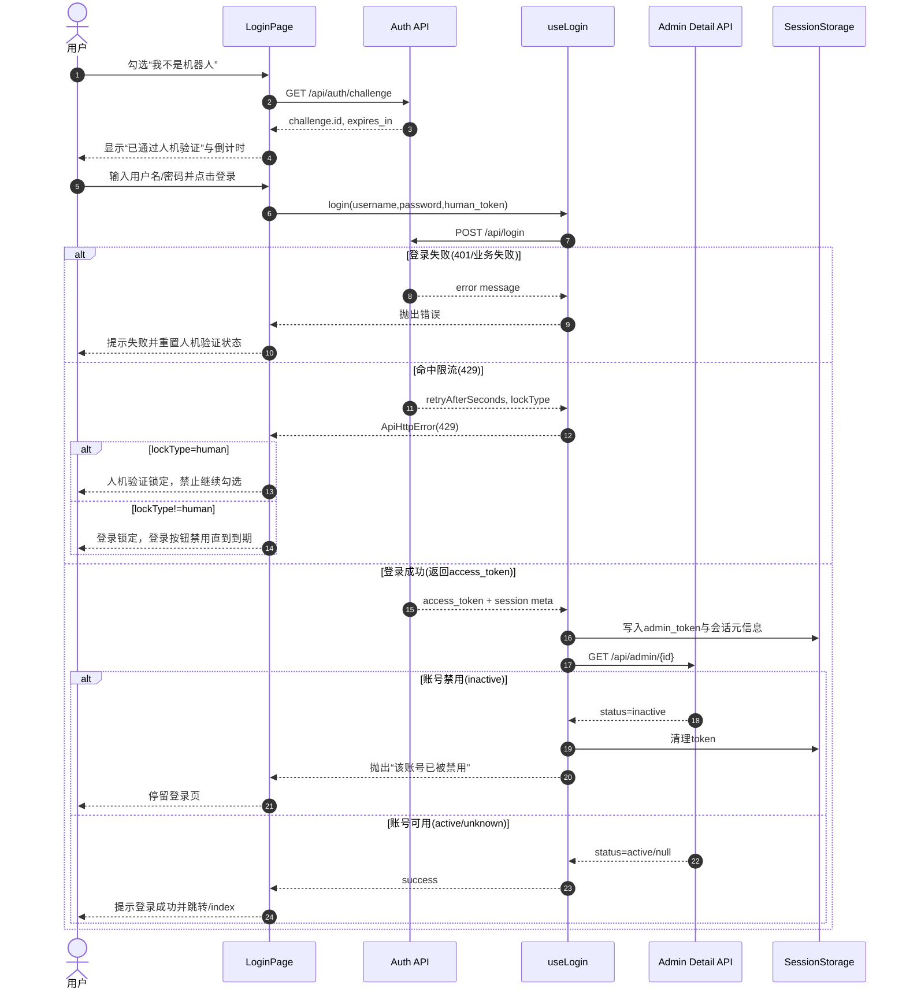
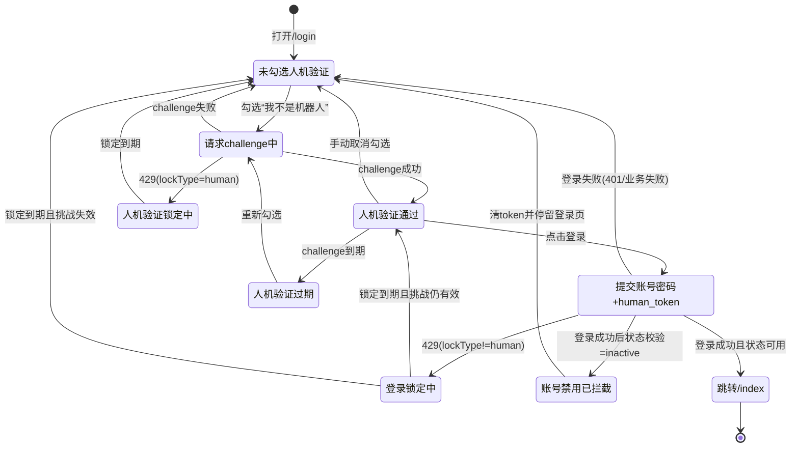

# 登录业务需求文档

## 1. 文档目的

- 明确管理端登录模块的业务需求、接口依赖与验收标准。
- 作为后续改造、联调、测试与回归的统一依据。

## 2. 业务范围

- 适用端：管理端（管理员登录）。
- 适用页面：`/login`。
- 模块边界：
  - 登录页面编排在 `modules/login`。
  - Token、会话、鉴权底层能力在 `auth` 模块。

## 3. 业务目标

- 仅允许通过人机验证的管理员发起登录。
- 登录成功后写入访问令牌与会话元信息。
- 对已禁用管理员进行拦截，阻止进入系统。
- 对登录/验证限流（429）提供锁定反馈与倒计时恢复。

## 4. 页面与交互需求

### 4.1 表单字段

- 用户名：必填。
- 密码：必填。
- 人机验证勾选框：`我不是机器人`。

### 4.2 登录按钮可用条件

登录按钮在以下条件全部满足前必须禁用：

- 人机验证已通过。
- 已取得 `human_token`。
- 当前不处于人机验证加载中。
- 当前不处于登录锁定期。

### 4.3 人机验证流程

- 用户勾选 `我不是机器人` 后，调用挑战接口获取 `challenge id`。
- 获取成功后：
  - 记录 `human_token`。
  - 显示“已通过人机验证，可以继续登录”。
  - 若返回有效期，展示挑战剩余时间倒计时。
- 验证过期后：
  - 自动清空人机验证状态。
  - 提示“人机验证已过期，请重新勾选后再试”。

### 4.4 登录失败后的状态回退

- 账号/密码错误等普通失败：重置人机验证状态。
- 人机验证相关失败（包含 `human_token` / `人机` / `challenge` 关键词）：
  - 提示“人机验证失败：...”。
  - 重置人机验证状态。

## 5. 接口需求

### 5.1 人机挑战接口

- 方法：GET
- 路径：`/api/auth/challenge`
- 期望返回：
  - `id`（必需）
  - `expires_in`（可选）

### 5.2 登录接口

- 方法：POST
- 路径：`/api/login`
- 请求体（业务层）：
  - `username`
  - `password`
  - `human_token`（必需，未提供必须拦截）

### 5.3 账号状态校验接口

- 登录成功后，前端需要请求管理员详情以确认账号状态。
- 若状态为 `inactive`：
  - 必须清除 token。
  - 必须提示“该账号已被禁用，无法登录”。
  - 必须停留在登录页。

## 6. 会话与存储需求

- 登录成功后必须保存：
  - `admin_token`
  - 会话元信息（如过期时间、预警时间、服务端时间偏移等，若接口返回）。
- 锁定相关时间戳需持久化：
  - 登录锁定：`admin_login_blocked_until`
  - 人机验证锁定：`admin_validation_blocked_until`
- 锁定到期后应自动解除。

## 7. 限流与锁定需求

### 7.1 人机验证锁定

- 当接口返回 `429` 且 `lockType=human` 时：
  - 进入人机验证锁定态。
  - 锁定期间禁止再次发起人机挑战。
  - 提示锁定信息。

### 7.2 登录锁定

- 当接口返回 `429` 且非 `lockType=human` 时：
  - 进入登录锁定态。
  - 锁定期间登录按钮禁用。
  - 到期自动恢复。

## 8. 成功路径需求

- 登录接口返回成功且 `access_token` 有效时：
  - 前端显示“登录成功”。
  - 跳转 `/index`。
  - 清除登录锁定状态。

## 9. 非功能需求

- 超时处理：登录与挑战请求应有超时保护，超时给出可理解错误提示。
- 错误可理解：错误信息优先使用后端可读 message。
- 可测试：关键路径需具备端到端测试覆盖。

## 10. 验收标准

### 10.1 核心验收

1. 未完成人机验证时，登录按钮不可用。
2. 人机验证成功后，登录按钮可用并显示挑战倒计时（若有有效期）。
3. 登录成功后跳转到 `/index` 且 token 已写入。
4. 管理员状态为 `inactive` 时，必须拦截登录并清理 token。
5. `429` 锁定场景下，锁定行为、提示与到期恢复符合预期。

### 10.2 回归检查

- 登录失败后人机状态是否按规则重置。
- 页面刷新后锁定状态是否可恢复。
- 锁定到期后是否自动解除。

## 11. 关联实现与测试

- 页面：`src/modules/login/pages/LoginPage.tsx`
- 编排：`src/modules/login/hooks/useLogin.ts`
- 鉴权服务：`src/auth/authentication/services/authService.ts`
- 会话管理：`src/auth/authentication/components/SessionTimeoutManager.tsx`
- 会话存储：`src/auth/authentication/services/sessionService.ts`
- 会话测试：`src/auth/authentication/components/SessionTimeoutManager.test.tsx`
- 存储测试：`src/auth/authentication/services/sessionService.test.ts`
- E2E：`tests/e2e/login.spec.ts`

## 12. 登录时序图（Mermaid）

## 13. 登录状态机图（Mermaid）

## 14. 导出图片（用于对外沟通）

- 时序图 PNG：[docs/diagrams/login-sequence.png](docs/diagrams/login-sequence.png)
- 时序图 SVG：[docs/diagrams/login-sequence.svg](docs/diagrams/login-sequence.svg)
- 状态机图 PNG：[docs/diagrams/login-state.png](docs/diagrams/login-state.png)
- 状态机图 SVG：[docs/diagrams/login-state.svg](docs/diagrams/login-state.svg)

## 15. Session 与 30 分钟时限整理

### 15.1 默认时限与可配置项

- 默认会话时限：`1800` 秒（30 分钟），配置项：`VITE_SESSION_TIMEOUT_SECONDS`。
- 默认过期预警：`300` 秒（5 分钟），配置项：`VITE_SESSION_WARNING_SECONDS`。
- 代码来源：`src/config.ts` 中 `SESSION_TIMEOUT_SECONDS` 与 `SESSION_WARNING_SECONDS`。

### 15.2 过期时间计算优先级

- 登录/续期响应若提供 `expires_at`，优先使用。
- 未提供 `expires_at` 但提供 `expires_in` 时，按“当前服务端时间 + expires_in”计算。
- 若接口未给出上述字段，则回退使用 JWT `exp`。
- 若仍无法解析，使用前端兜底：`当前时间 + 1800 秒`。

### 15.3 会话续期与超时行为

- 受保护路由挂载 `SessionTimeoutManager`，每秒评估剩余会话时间。
- 在进入预警窗口前（默认剩余时间 > 300 秒），前端不得主动调用会话续期接口，也不得推送会话活动快照到续期接口。
- 当进入预警窗口（默认最后 5 分钟）时：
  - 自动调用 `POST /api/auth/refresh` 尝试续期。
  - 打开不可点遮罩、不可 ESC 关闭的提示框，显示倒计时。
- 用户可点击“继续会话”手动重试续期；点击“立即退出”直接登出。
- 续期成功：刷新 `admin_token` 与会话元信息，关闭提示。
- 续期返回 `401` 或已到期：清理会话并跳转 `/login`。

### 15.4 本地存储与多标签页同步

- 关键存储项（localStorage）：
  - `admin_token`
  - `admin_session_expires_at`
  - `admin_session_warning_before_seconds`
  - `admin_session_server_offset_seconds`
  - `admin_session_started_at`
  - `admin_session_last_activity_at`
  - `admin_session_activity_events`
- `admin_session_activity_events` 仅保留最近 `5` 条活动事件（超过后按时间顺序丢弃更早记录）。
- 通过 `storage` 事件监听上述 key 变化，实现多标签页会话状态联动。

### 15.5 验收补充（session 维度）

1. 登录后会话默认 30 分钟，进入最后 5 分钟出现续期提示。
2. 剩余时间大于 5 分钟期间，不得发起 `POST /api/auth/refresh`。
3. 续期成功后倒计时重置，用户保持登录态。
4. 续期失败且返回 `401` 时，必须立刻清理 token 并回到 `/login`。
5. 多标签页中任一页登出，其他标签页需同步退出。

## 16. 网页刷新与基本操作口径澄清

### 16.1 登录页刷新后的状态要求

- 页面刷新后，必须恢复并继续生效以下锁定状态：
  - `admin_login_blocked_until`
  - `admin_validation_blocked_until`
- 若当前时间尚未到锁定截止时间：
  - 登录按钮继续禁用（登录锁定）。
  - 人机验证勾选继续禁用（人机验证锁定）。
- 锁定倒计时到期后自动解除锁定，无需再次刷新页面。
- 登录失败（包括普通失败与人机验证相关失败）应回退到未通过人机验证的初始登录态。

### 16.2 受保护页面刷新后的会话要求

- 刷新后若存在有效 `admin_token`，应继续按会话过期时间进行评估。
- 若刷新后无法解析过期时间（接口元信息与 JWT 均缺失），应使用“当前时间 + 30 分钟”兜底。
- 刷新后若会话已过期或续期返回 `401`，必须清理会话并跳转 `/login`。
- 多标签页场景下，任一标签页清理 `admin_token` 后，其他标签页必须同步退出。

### 16.3 基本操作定义（用于会话活动采集）

- 以下行为视为“有效活动”，用于续期快照与会话活跃判断：
  - 页面首次加载：`page_load`
  - 路由切换：`route_change`
  - 页面从后台切回前台：`visibility_visible`
  - 点击：`click`
  - 滚动：`scroll`
  - 键盘输入/按键：`keydown`
- 活动采集要求：
  - 需节流写入，避免高频事件导致存储抖动。
  - 仅保留最近 5 条活动事件，作为续期请求快照。

### 16.4 刷新与操作的边界说明

- 本文档中的“刷新/基本操作”口径仅针对登录与会话模块。
- 同步业务中“进行中禁止刷新”的交互要求属于同步模块规范，另见 `docs/prd.md`。

### 16.5 增补验收项

1. 在登录锁定或人机锁定期间刷新页面，锁定状态必须保持且到期自动解除。
2. 在受保护页面刷新后，会话倒计时必须延续，不得无故重置。
3. 点击、滚动、按键、切回前台、路由切换均可被记录为活动事件。
4. 多标签页中任一页登出或 token 被清空，其他标签页必须自动退出。

### 16.6 产品评审版（8 条）

1. 登录页刷新后，原有锁定状态必须保留，不能因为刷新就绕过限制。
2. 人机验证锁定期间，复选框不可再次触发验证；到期后自动恢复。
3. 登录锁定期间，登录按钮必须禁用；到期后自动恢复。
4. 登录失败后，页面必须回到“未完成人机验证”的初始状态，避免误用旧挑战。
5. 已登录页面刷新后，会话倒计时应连续，不允许无故重置为满时长。
6. 会话进入预警窗口时，系统应主动提示并尝试续期；用户可继续会话或立即退出。
7. 续期失败且鉴权无效时，必须立即清理登录态并回到登录页。
8. 多标签页必须保持一致：任一标签页退出登录，其他标签页同步退出。

## 17. 代码反向梳理需求总表（login + session）

> 本章节用于把“沉在代码里的业务逻辑”显式化，作为二次审阅与后续回归基线。

### 17.1 路由访问与登录入口

- `/login` 仅作为公开路由入口，登录页应支持懒加载失败后的“单次自动刷新重试 + 失败兜底页”。
- 任何受保护路由在无 `admin_token` 时，必须重定向到 `/login`。
- 受保护路由必须统一挂载会话管理器，保证会话倒计时、预警与超时退出策略一致。
- 角色为普通用户（`ROLE_USER`）时，不得进入特权路由，必须重定向到 `/index`。

### 17.2 登录前置与人机挑战

- 登录请求必须携带 `human_token`；未完成人机验证时，前端必须拦截提交。
- 人机挑战成功后才允许提交登录；若返回 `expires_in`，前端必须显示挑战倒计时。
- 挑战倒计时归零后，前端必须自动清空人机验证状态并提示重新勾选。
- 人机相关失败（`human_token` / `人机` / `challenge`）必须回退至未验证状态。

### 17.3 限流与锁定恢复

- `429 + lockType=human` 时必须进入人机验证锁定态，锁定期间禁止继续勾选。
- `429 + lockType!=human` 时必须进入登录锁定态，锁定期间登录按钮禁用。
- 登录锁定与人机锁定时间必须持久化到本地存储，页面刷新后仍然有效。
- 锁定到期必须自动解除，不依赖手工刷新页面。

### 17.4 登录响应解析与错误口径

- 登录响应应兼容 `access_token` 直出与 `data.access_token` / `data.token` 包装两种格式。
- 若业务码成功但缺少 token，前端必须视为失败并提示“登录成功但未返回令牌”。
- 登录、挑战、续期请求都必须具备超时保护（当前统一 10 秒）。
- 请求超时错误必须转换为可理解中文提示，不暴露底层异常细节。

### 17.5 登录后状态校验与准入

- 登录写入 token 后，必须进行管理员状态二次校验（详情接口）。
- 状态为 `inactive` 时必须清理登录态并拦截进入系统。
- 管理员状态校验异常不得阻断登录主流程，允许降级放行（按现行实现容错）。
- 登录成功后应写入展示档案（如用户名）用于壳层展示。

### 17.6 会话时限、预警与续期

- 默认会话时限 30 分钟，默认预警窗口 5 分钟，可通过环境变量覆盖。
- 在预警窗口前（剩余时间 > 5 分钟）不得调用 `POST /api/auth/refresh`。
- 进入预警窗口后允许自动触发一次决策续期；若失败，保留弹窗并允许手动重试。
- 续期弹窗必须不可点遮罩关闭、不可 ESC 关闭，避免无意识绕过会话决策。
- 续期返回 `401` 或会话到期时，必须立即清理会话并回到 `/login`。

### 17.7 活动采集与续期快照

- 以下事件应记为会话活动：`page_load`、`route_change`、`visibility_visible`、`click`、`scroll`、`keydown`、`manual_continue`。
- 活动写入需节流（当前 200ms）以避免高频事件抖动。
- 本地活动事件仅保留最近 5 条，用于构造续期请求快照。
- 续期请求应携带最近活动摘要（最新活动类型、时间戳、活动列表）。

### 17.8 本地存储与跨标签一致性

- 会话核心键（token/过期时间/预警时间/服务端时差/活动轨迹）必须写入 localStorage。
- 任一标签页清空 `admin_token` 时，其他标签页必须通过 `storage` 事件同步退出。
- 清理登录态时必须同步清理：token、展示信息、会话时间戳、活动轨迹、会话元信息。
- 401 跳转需具备防抖（短时间内避免重复重定向风暴）。

### 17.9 刷新相关行为边界

- 登录页刷新：锁定状态必须恢复，且到期自动解除。
- 受保护页刷新：会话倒计时应延续，不得无故重置满时长。
- 若无法从接口元信息或 JWT 解析过期时间，应使用“当前时间 + 会话默认时长”兜底。
- 懒加载 chunk 失败时，允许单次 `window.location.reload()` 自愈重试；再次失败显示兜底提示页。

### 17.10 代码定位（审阅入口）

- 路由守卫与会话挂载：`src/router/root.router.tsx`、`src/auth/authentication/components/RequireAdminAuth.tsx`、`src/router/guards.tsx`
- 登录页面与交互：`src/modules/login/pages/LoginPage.tsx`、`src/modules/login/hooks/useLogin.ts`
- 鉴权接口与响应规范：`src/auth/authentication/services/authService.ts`
- 会话存储与清理：`src/auth/authentication/services/sessionService.ts`
- 会话行为测试：`src/auth/authentication/components/SessionTimeoutManager.test.tsx`、`src/auth/authentication/services/sessionService.test.ts`

### 17.11 分层审阅清单（必须项 / 建议项 / 现状容错项）

#### A. 必须项（不满足即视为需求不达标）

1. 未登录访问受保护路由必须跳转 `/login`；普通用户不可进入特权路由。
2. 登录必须通过人机验证并携带 `human_token`；未通过时必须拦截提交。
3. `429` 锁定规则必须严格区分 `lockType=human` 与 `lockType!=human`，且锁定可刷新恢复、到期自动解除。
4. 登录成功后必须写入 token；账号状态为 `inactive` 必须拦截并清理登录态。
5. 会话默认时限 30 分钟、预警 5 分钟；剩余时间大于 5 分钟不得调用续期接口。
6. 会话到期或续期返回 `401` 时，必须立即清理并跳转 `/login`。
7. 多标签页必须一致：任一标签页退出后，其它标签页同步退出。

#### B. 建议项（建议纳入近期迭代）

1. 登录页懒加载失败采用“单次自动刷新重试 + 兜底页”策略，并记录诊断日志。
2. 续期弹窗保持强约束（不可点遮罩关闭、不可 ESC 关闭），降低误操作风险。
3. 活动采集事件类型保持完整（页面加载、路由、可见性、点击、滚动、按键、手动续期）。
4. 活动写入节流与最近 5 条快照策略保持稳定，避免高频写入影响性能。
5. 401 跳转防抖机制持续保留，避免并发请求造成重定向风暴。

#### C. 现状容错项（当前实现允许，但应明确风险）

1. 管理员状态二次校验失败时当前为“降级放行”，存在短时误放行风险。
2. 登录响应结构兼容多种 token 字段（直出/嵌套）会提高兼容性，但也增加后端规范漂移风险。
3. 会话过期时间在缺少服务端元信息时采用前端兜底（当前时间 + 默认时长），依赖前端时钟准确性。

#### D. 审阅建议顺序（评审会使用）

1. 先逐条确认 A 组必须项是否全部通过。
2. 再确定 B 组建议项的版本排期与责任人。
3. 最后评估 C 组容错项是否转为强约束需求。
